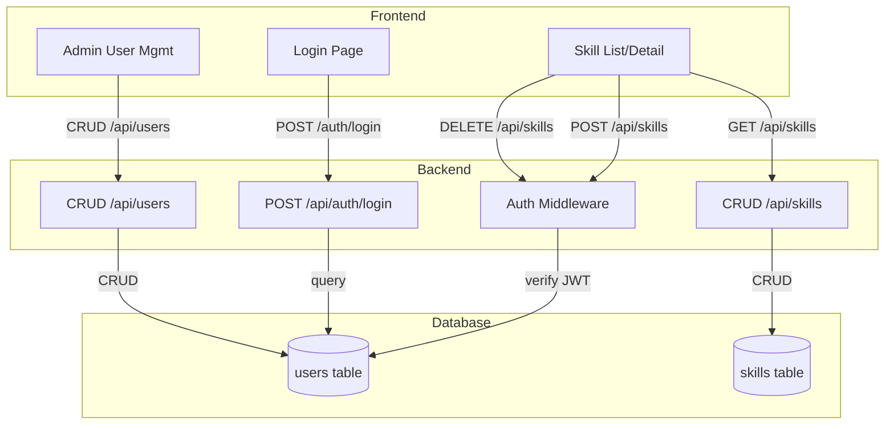

# User Management - Plan

## Goal Capsule

- **Objective:** 为 SkillHub 添加用户管理功能，包含三种角色（admin / publisher / viewer），管理员通过 Web UI 管理后台创建和管理用户，普通用户只能登录不能自行注册。
- **Product authority:** 本次对话中确认的范围和约束。
- **Open blockers:** 无。

---

## Product Contract

### Summary

为 SkillHub 添加完整的用户管理系统：基于 JWT 的认证机制，三种角色（admin / publisher / viewer），管理员通过 Web UI 后台创建和管理用户账号，普通用户只能登录不能自行注册。首个 admin 通过配置文件预设。技能浏览和安装保持公开，发布和删除需要认证。

### Problem Frame

SkillHub 当前没有任何认证和访问控制机制。所有 API 端点完全公开，任何人可以发布、修改和删除任何技能。之前的 token 认证系统因 SHA-256 哈希比对 bug 被完整移除。随着 SkillHub 被多个用户使用，需要身份认证和权限控制来保护技能数据。

### Requirements

**认证机制**

- R1. 系统使用 JWT (JSON Web Token) 进行身份认证，密码使用 bcrypt 算法加盐哈希存储。
- R2. 用户登录时验证用户名和密码，成功后签发 JWT，包含 user_id 和 role 声明。
- R3. 写操作端点（POST / DELETE / PUT）要求请求头携带 `Authorization: Bearer <token>`，未携带或 token 无效返回 401。读操作端点（GET /api/skills、文件下载）无需认证，保持公开访问。
- R4. JWT token 无过期时间，签发后长期有效。用户接受此风险。

**角色与权限**

- R5. 系统定义三种角色：admin（管理员）、publisher（发布者）、viewer（观察者）。
- R6. admin 可以执行所有操作：管理用户、发布和管理所有技能、查看所有内容。
- R7. publisher 只能发布和管理自己发布的技能（通过 `published_by` 字段关联）。
- R8. viewer 只能浏览和下载技能，不能发布、编辑或删除。
- R9. Web UI 页面（管理后台、用户管理）需要登录才能访问。技能列表和详情页保持公开。

**用户生命周期**

- R10. 管理员通过 Web UI 管理后台创建新用户，需提供用户名、密码、角色。
- R11. 管理员可以修改用户角色、删除用户、重置用户密码。
- R12. 用户可以修改自己的密码（需验证当前密码）。
- R13. 首个 admin 账号通过 `~/.skillhub/config.yaml` 配置文件预设（用户名和密码哈希）。
- R14. 管理员不能删除自己的账号（至少保留一个 admin）。

**技能所有权**

- R15. 发布技能时自动关联当前认证用户的 user_id 到 `published_by` 字段。
- R16. publisher 删除技能时验证 `published_by` 是否为当前用户，非本人拒绝。
- R17. admin 可以删除任何技能，不受 `published_by` 限制。

### Key Decisions

- **JWT 而非 Session：** 无状态认证适合 SQLite 单文件部署，无需服务端会话存储。CLI 和 API 共用同一套认证机制。Token 无过期时间，签发后长期有效。
- **配置文件预设 admin：** 自托管场景下最简单的初始设置方式，避免 CLI 命令的额外复杂度。密码在配置文件中以 bcrypt 哈希存储。
- **读操作公开，写操作需认证：** 技能浏览和安装保持公开访问（viewer 权限），发布和删除需要认证。平衡了易用性和安全性。
- **bcrypt 而非自定义哈希：** 吸取之前 SHA-256 哈希比对 bug 的教训，使用经过验证的 bcrypt 方案。

### Actors

- A1. **Admin（管理员）：** 系统管理者，负责创建用户、管理权限、管理所有技能。
- A2. **Publisher（发布者）：** 技能发布者，可以发布和管理自己的技能。
- A3. **Viewer（观察者）：** 只读用户，只能浏览和下载技能。

### Key Flows

- F1. 管理员创建用户
  - **Trigger:** Admin 在管理后台点击"创建用户"
  - **Actors:** A1
  - **Steps:** 填写用户名/密码/角色 → 提交 → 后端验证权限 → 创建用户记录 → 返回成功
  - **Covered by:** R10, R14

- F2. 用户登录
  - **Trigger:** 用户在登录页输入用户名和密码
  - **Actors:** A1, A2, A3
  - **Steps:** 提交凭证 → 后端验证 → 签发 JWT → 前端存储 token → 跳转到主页
  - **Covered by:** R1, R2, R3

- F3. Publisher 发布技能
  - **Trigger:** Publisher 在 Web UI 或 CLI 发布技能
  - **Actors:** A2
  - **Steps:** 上传技能文件 → 后端验证角色 → 关联 published_by → 存储技能 → 返回成功
  - **Covered by:** R7, R15

- F4. Publisher 删除自己的技能
  - **Trigger:** Publisher 点击删除自己发布的技能
  - **Actors:** A2
  - **Steps:** 确认删除 → 后端验证 published_by == 当前用户 → 删除技能 → 返回成功
  - **Covered by:** R16

- F5. 管理员重置用户密码
  - **Trigger:** Admin 在管理后台选择用户并重置密码
  - **Actors:** A1
  - **Steps:** 选择用户 → 输入新密码 → 后端验证权限 → 更新密码哈希 → 通知用户
  - **Covered by:** R11

### Scope Boundaries

**Deferred for later:**
- 自注册功能 — 当前版本不支持，用户必须由 admin 创建
- OAuth / SSO 集成 — 引入外部依赖，超出轻量级范围
- 2FA / TOTP 双因素认证 — 自托管场景下优先级低
- 审计日志 — 依赖用户系统，可后续实现
- API Key 管理 — 用于 CI/CD 自动化，可后续实现
- 用户个人主页 / Dashboard — 锦上添花

**Outside this product's identity:**
- 团队 / 组织支持 — 超出当前单实例注册中心的范围
- LDAP / Active Directory 集成 — 企业级需求
- 社交登录 (GitHub, Google) — 引入外部 API 依赖

### Acceptance Examples

- AE1. 管理员创建 publisher 用户
  - **Given:** Admin 已登录管理后台
  - **When:** 创建一个角色为 publisher 的新用户，用户名 "alice"，密码 "pass123"
  - **Then:** 用户创建成功，alice 可以使用该账号登录

- AE2. 未登录访问读操作正常，写操作被拒绝
  - **Given:** 用户未登录
  - **When:** 访问 `GET /api/skills` 或下载技能文件
  - **Then:** 正常返回数据（公开访问）
  - **When:** 访问 `POST /api/skills` 或 `DELETE /api/skills/{id}`
  - **Then:** 返回 401 Unauthorized

- AE3. Publisher 不能删除他人技能
  - **Given:** Publisher "alice" 已登录，技能 X 的 published_by 为 "bob"
  - **When:** alice 尝试删除技能 X
  - **Then:** 返回 403 Forbidden

- AE4. Admin 可以删除任何技能
  - **Given:** Admin 已登录，技能 Y 的 published_by 为 "alice"
  - **When:** Admin 删除技能 Y
  - **Then:** 技能删除成功

- AE5. 用户修改自己的密码
  - **Given:** Publisher "alice" 已登录
  - **When:** 提交当前密码和新密码
  - **Then:** 密码更新成功，使用旧密码登录失败，使用新密码登录成功

### Dependencies / Assumptions

- 假设 SkillHub 部署在可信网络环境（如团队内部），不需要防范暴力破解攻击
- 假设管理员能直接编辑配置文件来设置初始 admin 账号
- 假设 SQLite 能满足当前用户规模的并发需求
- 依赖 `passlib[bcrypt]` 库进行密码哈希（需添加到 `pyproject.toml`）
- 依赖 `PyJWT` 库进行 JWT 签发和验证（需添加到 `pyproject.toml`）

---

## Planning Contract

### High-Level Technical Design



### Key Technical Decisions

- KTD1. **数据库迁移：** 在 `Database.connect()` 中添加 `users` 表的 `CREATE TABLE IF NOT EXISTS`，以及 `skills.published_by` 字段的 `ALTER TABLE ADD COLUMN` 迁移。使用与现有 `download_count` 迁移相同的 try/except 模式。
- KTD2. **认证中间件位置：** 在 `skillhub/api/deps.py` 中添加 `get_current_user` 依赖函数，解析 JWT 并返回用户信息。写操作端点通过 `Depends(get_current_user)` 注入。
- KTD3. **密码哈希工具：** 在 `skillhub/auth.py` 中集中管理 `hash_password()` 和 `verify_password()` 函数，使用 `passlib[bcrypt]`。
- KTD4. **配置文件 admin 预设：** 在 `AppConfig` 中添加 `admin` 字段（username + password_hash），启动时自动创建/同步 admin 用户到数据库。
- KTD5. **前端 token 管理：** 登录成功后将 JWT 存储在 `localStorage`，API 客户端自动附带 `Authorization` 头。

### Assumptions

- SQLite 的并发能力足以支撑当前用户规模
- 管理员能直接编辑配置文件
- 部署在可信网络环境，不需要速率限制或暴力破解防护

---

## Implementation Units

### U1. 数据模型和数据库迁移

**Goal:** 创建 users 表，添加角色枚举，修改 skills.published_by 字段。

**Files:**
- `skillhub/database.py` — 添加 users 表 schema，添加迁移逻辑
- `skillhub/models.py` — 添加 User 相关 Pydantic 模型

**Approach:**
在 `database.py` 的 `SCHEMA` 中添加 `users` 表：
```sql
CREATE TABLE IF NOT EXISTS users (
    id TEXT PRIMARY KEY,
    username TEXT NOT NULL UNIQUE,
    password_hash TEXT NOT NULL,
    role TEXT NOT NULL DEFAULT 'viewer' CHECK(role IN ('admin', 'publisher', 'viewer')),
    created_at TIMESTAMP DEFAULT CURRENT_TIMESTAMP,
    updated_at TIMESTAMP DEFAULT CURRENT_TIMESTAMP
);
```

在 `connect()` 方法中添加迁移：将 `skills.published_by` 从 `TEXT` 改为存储 `user_id`（已存在，无需迁移）。添加 users 表创建。

在 `models.py` 中添加：
- `UserBase(username, role)`
- `UserCreate(username, password, role)`
- `UserResponse(id, username, role, created_at, updated_at)`
- `UserPasswordChange(old_password, new_password)`
- `LoginRequest(username, password)`
- `TokenResponse(access_token, token_type)`

**Test expectation:** 数据库迁移测试 — 创建数据库后 users 表存在，可以插入和查询用户。

---

### U2. 密码哈希和 JWT 工具

**Goal:** 实现密码哈希和 JWT 签发/验证的工具函数。

**Files:**
- `skillhub/auth.py` — 新建，密码哈希和 JWT 工具
- `pyproject.toml` — 添加 `passlib[bcrypt]` 和 `PyJWT` 依赖

**Approach:**
创建 `skillhub/auth.py`：
- `hash_password(password: str) -> str` — bcrypt 加盐哈希
- `verify_password(password: str, hashed: str) -> bool` — 验证密码
- `create_token(user_id: str, role: str) -> str` — 签发 JWT（无过期时间）
- `decode_token(token: str) -> dict` — 解码 JWT，返回 payload
- `SECRET_KEY` — 从环境变量 `SKILLHUB_SECRET_KEY` 读取，未设置则自动生成并打印警告

**Test expectation:** 单元测试 — hash_password 返回哈希，verify_password 正确验证，create_token/decode_token 往返正确。

---

### U3. 认证 API 端点

**Goal:** 实现登录端点和用户 CRUD 端点（admin only）。

**Files:**
- `skillhub/api/auth.py` — 新建，登录端点
- `skillhub/api/users.py` — 新建，用户管理端点
- `skillhub/main.py` — 注册新路由
- `skillhub/api/deps.py` — 添加 `get_current_user` 依赖

**Approach:**
在 `skillhub/api/deps.py` 中添加：
- `get_current_user(request: Request)` — 从 Authorization 头解析 JWT，查询用户，返回用户信息。无 token 或无效返回 None（允许公开端点使用）。
- `require_auth(request: Request)` — 同上但无 token 时 raise 401。

在 `skillhub/api/auth.py` 中：
- `POST /api/auth/login` — 接受 LoginRequest，验证密码，返回 TokenResponse

在 `skillhub/api/users.py` 中（所有端点 require admin role）：
- `GET /api/users` — 列出所有用户
- `POST /api/users` — 创建用户
- `PUT /api/users/{user_id}` — 修改用户角色
- `DELETE /api/users/{user_id}` — 删除用户（不能删除自己）
- `POST /api/users/{user_id}/reset-password` — 重置密码
- `POST /api/auth/change-password` — 当前用户修改自己的密码

**Test expectation:** API 测试 — 登录成功/失败，用户 CRUD 权限检查，非 admin 拒绝。

---

### U4. 技能端点添加认证

**Goal:** 为写操作端点添加认证要求，实现技能所有权检查。

**Files:**
- `skillhub/api/skills.py` — 修改 publish_skill 和 delete_skill

**Approach:**
修改 `publish_skill`：
- 添加 `current_user = Depends(require_auth)` 参数
- 设置 `published_by=current_user["id"]`

修改 `delete_skill`：
- 添加 `current_user = Depends(require_auth)` 参数
- 如果 `current_user["role"] != "admin"`，检查 `published_by == current_user["id"]`
- 非本人非 admin 返回 403

**Test expectation:** 测试 — 未认证发布返回 401，publisher 删除他人技能返回 403，admin 可以删除任何技能。

---

### U5. 配置文件 admin 预设

**Goal:** 从配置文件读取 admin 账号信息，启动时自动创建。

**Files:**
- `skillhub/config.py` — 添加 AdminConfig 模型
- `skillhub/main.py` — 启动时创建 admin

**Approach:**
在 `config.py` 中添加：
```python
class AdminConfig(BaseModel):
    username: str = "admin"
    password_hash: str = ""
```

在 `AppConfig` 中添加 `admin: AdminConfig`。

在 `main.py` 的 lifespan 中：读取配置的 admin 信息，如果数据库中不存在该用户名，则创建 admin 用户。

**Test expectation:** 测试 — 配置 admin 后启动，数据库中存在该 admin 用户。

---

### U6. CLI 认证命令

**Goal:** 添加 `skillhub auth login` 和 `skillhub auth logout` 命令。

**Files:**
- `skillhub/cli/commands/auth.py` — 新建，auth 命令组
- `skillhub/cli/main.py` — 注册 auth 命令
- `skillhub/cli/commands/push.py` — 添加 token 附带

**Approach:**
创建 `skillhub/cli/commands/auth.py`：
- `skillhub auth login` — 交互式输入用户名密码，调用 `/api/auth/login`，将 token 存储到 `~/.skillhub/config.yaml` 的 `api_token` 字段
- `skillhub auth logout` — 清除 config 中的 `api_token`
- `skillhub auth status` — 显示当前登录状态

修改 `push.py`：读取 config 中的 `api_token`，如果有则添加 `Authorization: Bearer <token>` 头。

**Test expectation:** 测试 — login 存储 token，logout 清除 token，push 附带 token 头。

---

### U7. Web UI 登录和管理页面

**Goal:** 添加登录页面和管理员用户管理页面。

**Files:**
- `skillhub/static/js/auth.js` — 新建，登录逻辑
- `skillhub/static/js/admin.js` — 新建，用户管理逻辑
- `skillhub/static/index.html` — 添加登录表单和管理入口
- `skillhub/static/css/style.css` — 添加登录和管理页面样式
- `skillhub/static/locales/en.json` — 添加 i18n 字符串
- `skillhub/static/locales/zh-CN.json` — 添加 i18n 字符串

**Approach:**
在 `index.html` 中添加：
- 登录表单（默认显示，技能列表隐藏）
- 管理后台入口按钮（admin 可见）

在 `auth.js` 中：
- `login(username, password)` — 调用 `/api/auth/login`，存储 token 到 localStorage
- `logout()` — 清除 token
- `isLoggedIn()` — 检查 token 是否存在
- `getToken()` — 获取存储的 token

在 `admin.js` 中：
- 用户列表、创建用户、修改角色、删除用户、重置密码的 CRUD 操作

修改 `api.js`：在 `request()` 方法中自动附带 `Authorization` 头。

**Test expectation:** 手动测试 — 登录流程、admin 管理用户、权限控制。

---

### U8. 更新现有测试

**Goal:** 更新现有测试以适配认证系统。

**Files:**
- `tests/test_api.py` — 添加认证相关测试，更新现有测试

**Approach:**
- 添加 `test_login_success` 和 `test_login_failure`
- 添加 `test_auth_required_for_write` — 未认证发布返回 401
- 添加 `test_publisher_cannot_delete_others_skill` — publisher 删除他人技能返回 403
- 添加 `test_admin_can_delete_any_skill` — admin 可以删除任何技能
- 更新现有 `publish_skill` 测试：添加认证 token
- 添加用户 CRUD 测试

**Test expectation:** 所有测试通过。

---

## Verification Contract

| Gate | Command | Applies to |
|------|---------|-----------|
| Unit tests | `pytest tests/ -v` | All units |
| API integration | `pytest tests/test_api.py -v` | U3, U4, U8 |
| Database migration | `pytest tests/test_database.py -v` | U1 |
| CLI smoke test | `skillhub auth status` | U6 |
| Server startup | `uvicorn skillhub.main:app` | All |

---

## Definition of Done

- [ ] users 表创建成功，可以 CRUD 用户
- [ ] JWT 认证工作正常，登录返回 token
- [ ] 写操作端点要求认证，读操作公开
- [ ] publisher 只能管理自己的技能
- [ ] admin 可以管理所有技能和用户
- [ ] 配置文件预设 admin 自动创建
- [ ] CLI `skillhub auth login/logout` 工作正常
- [ ] Web UI 登录页面可用
- [ ] 管理后台用户管理页面可用
- [ ] 所有现有测试通过
- [ ] 新增测试覆盖核心功能
